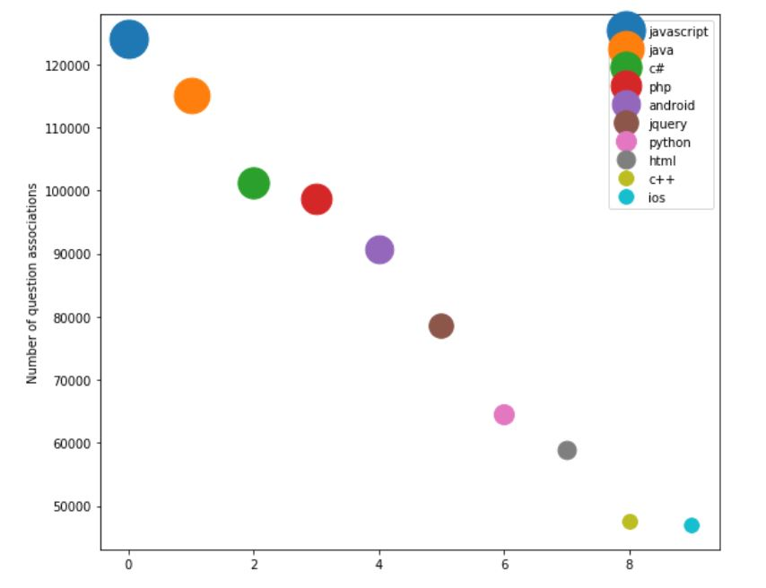
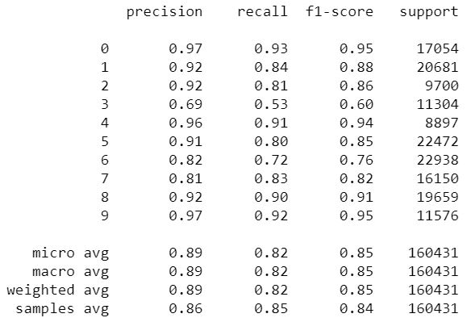
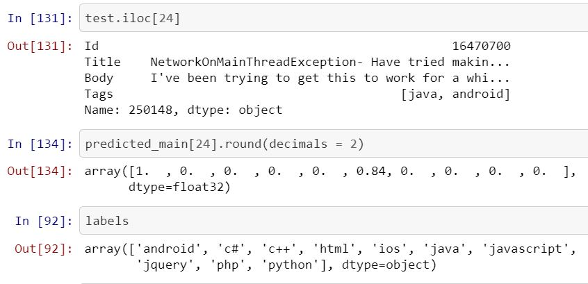

# Multiclass Multilabel Prediction For StackOverflow Questions

**Data set** : https://www.kaggle.com/therajeshreddy/stackoverflow

**Objective** : Given text for Questions from StackoverFlow posts, predict tags associated with them.

This is a scaled down version of predecting only top 10 most occurring tags 

**Programming Language** : Python using nltk & Keras

**Model Architecture** : Deep Learning using Recurrent Neural Network (RNN)

**About Data Set** 

Dataset has text of questions, answers and thier corresponding tags from the Stack Overflow programming Q&A website.

This is organized as three files:

1. Questions contains the title, body, creation date, closed date (if applicable), score, and owner ID for all non-deleted Stack Overflow questions.

2. Tags contains the tags on each of these questions.

3. Answers contains the body, creation date, score, and owner ID for each of the answers to these questions. The ParentId column links back to the Questions table. *We don't use this file as we want to predict Tags given a question*

**Data Pre-Processing**

>Questions File
*Code* : Stackoverflow Clean Questions.ipynb

1. Read Questions File
2. Drop All columns except Id,Title and Body
3. Now the text in the Body column seem to have many html tags in the text. We use Regular Expressions and Clean the Body column text by removing the html tags
```python
import re 
def rem_html_tags(body):
    regex = re.compile('<.*?>')
    return re.sub(regex, '', body)
ques['Body'] = ques['Body'].apply(rem_html_tags)
```
4. Save the questions file for later use
```python
ques.to_csv('question_clean.csv',index=False)
```

>Tags File
*Code* : Stackoverflow Tags Map & Model.ipynb

1. Read Tags File
2. Identify top 10 Tags by count
```python
tagCount =  collections.Counter(list(df_tags['Tag'])).most_common(10)
print(tagCount)

[('javascript', 124155), ('java', 115212), ('c#', 101186), ('php', 98808), ('android', 90659), ('jquery', 78542), ('python', 64601), ('html', 58976), ('c++', 47591), ('ios', 47009)]
```



3. Manipulate the tags dataframe so that all the Tags for an ID are as a list in a row (grouped by Question ID)

```python
def add_tags(question_id):
    return tag_top10[tag_top10['Id'] == question_id['Id']].Tag.values

top10 = tag_top10.apply(add_tags, axis=1)
```


>Combine the Questions and Tags
*Code* : Stackoverflow Tags Map & Model.ipynb

Merge the Questions and Tags data frame by ID

```python
total=pd.merge(ques, top10_tags, on='Id')
```

Our Dataset would now have only Id, Title, Body & Tags

>Text Preprocessing
*Code* : Stackoverflow Tags Map & Model.ipynb

We will use nltk, preprocessing from Keras and sklearn to process the text data

*Tags preprocesing*
Use MultiLabelBinarizer from sklearn on the Class labels(Tags)
```python
from sklearn.preprocessing import MultiLabelBinarizer
multilabel_binarizer = MultiLabelBinarizer()
multilabel_binarizer.fit(total.Tags)
print(multilabel_binarizer.classes_)

array(['android', 'c#', 'c++', 'html', 'ios', 'java', 'javascript','jquery', 'php', 'python'], dtype=object)
```

*Title & Body Preprocessing*
1. Tokenize the words
2. Convert the tokenized words to sequences

**Model Building** 

Implemented a Hybrid model in TensorFlow using Keras as high level api. Architecture used is RNN. In this model first we train a model using the Title data, then train a model using the Body data. Outputs of both are concatenated and passed thorugh the dense layers before connecting to the output layer

*RNN Model* : The model first uses GRU for the sequence data training with 2 GRU layers one for Title and other for Body. 

RNN for Title has
  - 1 Embedding Layer has input of Title vocabulary length(68969) + 1(for 0 padding) and out put of 2000 embeddings (for better results use full vocabulary length+1)
  - 1 Gated recurrent unit (GRU) layer
  - 1 dense output layer of shape 10(No of classes(tags) we are trying to predict) 

```python
    # Title Only
    title_input = Input(name='title_input',shape=[max_len_t])
    title_Embed = Embedding(vocab_len_t+1,2000,input_length=max_len_t,mask_zero=True,name='title_Embed')(title_input)
    gru_out_t = GRU(300)(title_Embed)
    # auxiliary output to tune GRU weights smoothly 
    auxiliary_output = Dense(10, activation='sigmoid', name='aux_output')(gru_out_t) 
```

RNN for Body has
  - 1 Embedding Layer has input of Title vocabulary length(1292018) + 1(for 0 padding) and out put of 170 embeddings (for better results use full vocabulary length+1)
  - 1 Gated recurrent unit (GRU) layer

```python
    # Body Only
    body_input = Input(name='body_input',shape=[max_len_b]) 
    body_Embed = Embedding(vocab_len_b+1,170,input_length=max_len_b,mask_zero=True,name='body_Embed')(body_input)
    gru_out_b = GRU(200)(body_Embed) 
```

Combine the 2 GRU outputs
```python
    com = concatenate([gru_out_t, gru_out_b])
```

The fully connected network has
  - 2 Dense Layers 
  - 1 Dropout layer
  - 1 BatchNormalization layer
  - 1 Dense Output layer
  
```python
    # now the combined data is being fed to dense layers
    dense1 = Dense(400,activation='relu')(com)
    dp1 = Dropout(0.5)(dense1)
    bn = BatchNormalization()(dp1) 
    dense2 = Dense(150,activation='relu')(bn)
    main_output = Dense(10, activation='sigmoid', name='main_output')(dense2)
```

*Model Compilattion with optimizer='adam', loss='categorical_crossentropy', metrics='accuracy')*

**Model Performance Review**

*Classification Report to check Precision, Recall and F1 Score*

The Model seem to performing good enough with score of 84%. Increase in the Embedding, GRU and dense layers would help in getting better results



**Random Validation on Test Data**




**Save the Model & Weights**

Saving the model for transfer learning or model execution later

```python
model.save('./stackoverflow_tags.h5')
```
